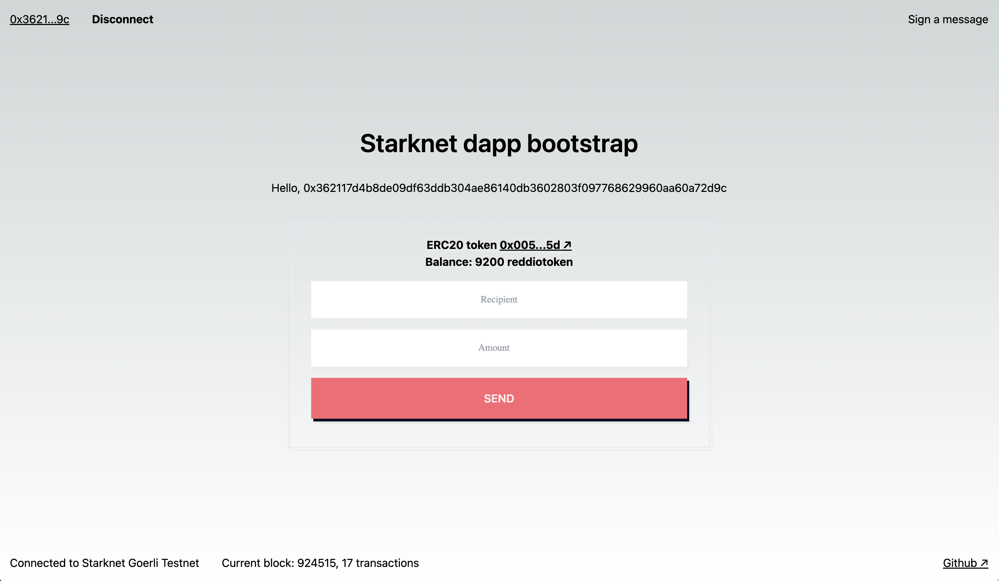

# Token app bootstrap on Starknet

This is a [Starknet token app](https://starknet-token-bootstrap.vercel.app/) project bootstrapped with [`create-next-app`](https://github.com/vercel/next.js/tree/canary/packages/create-next-app) and [starknet-react](https://github.com/apibara/starknet-react).



## Getting Started

First, clone the repo and install the dependencies:

```sh
git clone git@github.com:reddio-com/starknet-token-bootstrap.git
```

```sh
cd starknet-token-bootstrap
```

Next, go to /deploy folder, compile and deploy the ERC20 smart contract by following this [guide](https://github.com/reddio-com/cairo).

Then, register your Reddio account to get API Key from [Dashboard](https://dashboard.reddio.com/), fill your API Key at .env file,

```javascript
NEXT_PUBLIC_REDDIO_API_KEY="your-reddio-api-key"
```

Finally, run the development server:

```bash
npm run dev
# or
yarn dev
```

Open [http://localhost:3000](http://localhost:3000) with your browser to see the result.
